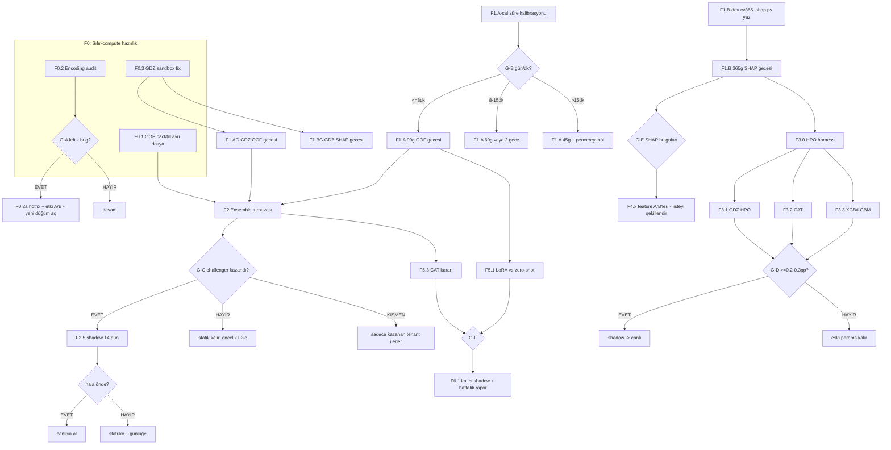

# MODEL AUDIT & OPTİMİZASYON — YAŞAYAN YOL HARİTASI (ADM + GDZ)

> **Bu doküman bir AI agent'ın sıfır bağlamla devralıp işletebileceği şekilde yazılmıştır.**
> Tek doğruluk kaynağı budur. Sürüm: v2 (2026-07-13). Amaç: her gün ulaşılabilir en düşük
> teslim-MAPE'si (headline: T+2). Plan, karar kapılarında (§F) bulgulara göre ŞEKİL DEĞİŞTİRİR.

---

## §A — AGENT PROTOKOLÜ (önce bunu oku)

1. **§C Durum Panosu**'nu oku → durumu `HAZIR` olan ve bağımlılıkları `TAMAM` olan en yüksek
   öncelikli düğümü seç.
2. Düğümün §E'deki spesifikasyonunu uygula. Uzun koşuları (gece işleri) **kullanıcı başlatır** —
   agent script'i hazırlar, komutu verir, sonucu bir SONRAKİ oturumda işler.
3. Düğüm bitince: §C'de durumunu güncelle, üretilen artefakt yolunu yaz, §H Karar Günlüğü'ne
   tarihli bir satır ekle (ne yapıldı, ne bulundu, hangi kapı nasıl değerlendirildi).
4. Bir **karar kapısına** (§F) gelindiyse: kapının koşulunu veriyle değerlendir, dallanmayı uygula —
   bu, §C'deki düğümlerin durumunu `HAZIR`/`İPTAL`/`BEKLİYOR` yapmak ve gerekiyorsa §E'ye YENİ
   düğüm eklemek demektir (ID kuralı: mevcut fazın altına `F4.7` gibi sıradaki numara).
5. **Silme yok**: §G Bulgular Eki ve §H Karar Günlüğü append-only'dir. İptal edilen düğüm silinmez,
   `İPTAL` işaretlenir + gerekçe günlüğe.
6. Her oturum başında **§B-K1 canlı-devrilme kontrolünü** yap (aşağıda).

**Durum kodları**: `BEKLİYOR` (bağımlılık bitmedi) · `HAZIR` (başlanabilir) · `KOŞUYOR`
(uzun iş başlatıldı, sonuç bekleniyor) · `TAMAM` · `BLOKE` (gerekçe günlükte) · `İPTAL`.

---

## §B — DEĞİŞMEZ KURALLAR (governance & güvenlik)

- **K0 — Kanıtsız canlı değişiklik YOK.** Canlı pipeline davranışını değiştiren her şey
  (ağırlık, feature, param, postprocess) önce walkforward A/B, sonra 14 gün shadow-mode
  kanıtı ister. Berabere = statüko.
- **K1 — Canlı-devrilme nöbeti.** ADM canlı cascade'i OOF birikimine bağlı OTOMATİK şema
  değiştirir: `data/oof_history.parquet` ≥14 gün olunca inverse-MAPE'ye, ≥168 temiz satırda
  Rolling Ridge'e atlar (`pipeline/04_predict_48h.py:stack_predictions`). GDZ'de
  `monitoring.duckdb` ≥14 gün T2 satırı olunca rolling'e geçer (canlı loglama 07-07 başladı →
  **~07-21 civarı kendiliğinden devrilir**). Bu geçişler A/B'siz olur — her oturumda gün
  sayısını kontrol et; eşik yaklaşıyorsa kullanıcıya bildir ve G-C kararını öne çek.
- **K2 — Canlı `data/oof_history.parquet`'e backfill YAZMA.** Backfill ayrı dosyaya gider
  (F0.1). Canlıya taşıma yalnızca G-C kararıyla.
- **K3 — GDZ walkforward'ı sandbox fix'ten (F0.3) önce ÇALIŞTIRMA.**
  `gdz talep/live/backtest_walkforward_gdz.py` canlı master'ı in-place değiştiriyor —
  07-06 master korupsiyon olayının birebir tekrarı riski.
- **K4 — Uzun koşularda subprocess çıktısı DOSYAYA yönlendirilir** (stdout=PIPE deadlock,
  kanıtlanmış ders). Örn: `python script.py > logs\x.log 2>&1` (bash) — PowerShell 5.1'de
  `2>&1` yerine `python script.py *> logs\x.log`.
- **K5 — Rolling Ridge mevcut formülasyonuyla (kısıtsız + intercept'li) canlıya alınmaz**
  (bkz. §G-B4). Önce kısıtlı kombinasyona (w≥0, Σw=1, interceptsiz) çevrilir ve turnuvada yarışır.
- **K6 — LightGBM save**: OneDrive Unicode-yol bug'ı → `model_to_string()+open()` deseni
  korunur (mevcut kodda çözülü, yeni script yazarken de uygula).
- **K7 — Bu doküman dışında plan kopyası tutma** (drift önlemi). Özet gerekiyorsa buraya link ver.

**Hızlı bağlam (sabit gerçekler)**
- ADM kökü: `…\çağatay\adm live` (bu repo) · GDZ kökü: `…\çağatay\gdz talep` (canlı: `live/` alt dizini).
- Veri: iki master da 2018-01-01 → bugün (~74.7k satır). ADM feature matrisi 157 kolon.
- ADM canlı ensemble ŞU AN fiilen statik: XGB .40 / LGBM .10 / CAT .05 / CHRONOS .45.
  GDZ fiilen DEFAULT: LGBM .27 / CAT .24 / XGB .27 / CHRONOS .22.
- ADM REGEN artefaktları (F0.1 girdisi): `output/YYYY.MM/GG/<tarih>_models_REGEN.parquet` — **35 gün mevcut** (2026-06-10'dan itibaren).
- ADM canlı OOF: `data/oof_history.parquet` (2026-07-13 itibarıyla 4 gün / 96 satır, horizon kolonu YOK).
- Loglar OneDrive DIŞI: `%LOCALAPPDATA%\adm_live_logs\` ve `%LOCALAPPDATA%\gdz_live_logs\` (monitoring.duckdb + forecast/actuals parquet).
- Walkforward aracı (ADM, sandbox'lı, kanıtlı): `backtest_walkforward.py --start YYYY-MM-DD --end YYYY-MM-DD [--force]`.

---

## §C — DURUM PANOSU (agent burayı günceller)

| ID | Düğüm | Durum | Bağımlılık | Artefakt / Not |
|---|---|---|---|---|
| F0.1 | ADM OOF backfill (ayrı dosya + horizon) | TAMAM | — | `data/oof_history_backfill.parquet` (1680 satır, 36 gün, T+1/T+2 840/840) |
| F0.2 | Encoding & veri bütünlüğü audit'i | TAMAM | — | `logs/audit_encodings_report.json` + `logs/audit_encodings_summary.md`; G-A=EVET (düşük-orta önem) |
| F0.2a | Milli_Bayram + Ramazan/Kurban gün-no hotfix + etki A/B | HAZIR | F0.2 (G-A) | düşük öncelik — F1.B SHAP'ı bekliyor, F1.B'yi BLOKE ETMİYOR |
| F0.3 | GDZ walkforward sandbox fix | HAZIR | — | `backtest_walkforward_gdz.py` |
| F1.A-cal | ADM walkforward süre kalibrasyonu (2 gün) | HAZIR | — | → kapı G-B |
| F1.A | ADM 90g as-of 4-model OOF koşusu (gece) | BEKLİYOR | F1.A-cal (G-B) | kullanıcı başlatır |
| F1.B-dev | `experiments/cv365_shap.py` scriptini yaz | HAZIR | — | GBDT-only, stride-7, TreeSHAP |
| F1.B | ADM 365g SHAP CV koşusu (gece) | BEKLİYOR | F1.B-dev | kullanıcı başlatır |
| F1.AG | GDZ as-of OOF koşusu (gece) | BEKLİYOR | F0.3 | |
| F1.BG | GDZ SHAP CV koşusu (gece) | BEKLİYOR | F0.3, F1.B-dev | script parametrize |
| F2 | Ensemble turnuvası (offline) | BEKLİYOR | F0.1 VEYA F1.A (ikisi = daha iyi) | → kapı G-C |
| F2.5 | Shadow-mode challenger loglama | BEKLİYOR | G-C=EVET | |
| F3.0 | Optuna HPO harness (fold'lu) | BEKLİYOR | F1.B (fold tanımları) | |
| F3.1 | GDZ HPO turu (EN YÜKSEK beklenen kazanç) | BEKLİYOR | F3.0 | → kapı G-D |
| F3.2 | ADM CAT HPO turu | BEKLİYOR | F3.0 | → kapı G-D |
| F3.3 | ADM XGB/LGBM HPO turu | BEKLİYOR | F3.0 | → kapı G-D |
| F4.* | Feature A/B düğümleri | BEKLİYOR | G-E şekillendirir | aday listesi §E-F4 |
| F5.1 | Chronos LoRA vs zero-shot (ADM) | BEKLİYOR | F1.A | → kapı G-F |
| F5.2 | GDZ LoRA pilotu | BEKLİYOR | F1.AG | → kapı G-F |
| F5.3 | CAT emeklilik kararı (ADM) | BEKLİYOR | F2 | → kapı G-F |
| F6.1 | Shadow-mode kalıcılaştırma + haftalık rapor | BEKLİYOR | F2.5 | |
| F7.1 | Postprocess adım-bazlı delta lineage'ı | BEKLİYOR | kullanıcı onayı (§I, davranış değiştirmez) | |
| F7.2 | Waterfall görünümü (ham→final kim ne ekledi) | BEKLİYOR | F7.1 | dashboard kartı |
| F7.3 | BaseForecaster arayüz sözleşmesi + golden testler | BEKLİYOR | kullanıcı onayı + **Emre koordinasyonu** (§I kapsam sınırı) | |

Öncelik sırası (eşit-HAZIR durumda): **F0.2 → F0.1 → F1.A-cal → F1.B-dev → F0.3**.
(Gerekçe: F0.2 ucuz ve her şeyi etkiler; F1.A-cal bu geceki koşunun ön koşulu.)

---

## §D — YOL ŞEMASI



---

## §E — DÜĞÜM SPESİFİKASYONLARI

### F0.1 — ADM OOF backfill (ayrı dosyaya, horizon etiketli)
- **Amaç**: Ensemble turnuvasına (F2) 35 günlük gerçek as-of OOF verisi sağlamak.
- **Girdi**: `output/YYYY.MM/GG/<tarih>_models_REGEN.parquet` (35 adet) + master actual'ları.
- **Yöntem**: `experiments/oof_backfill_pilot.py` (5 günlük dry-run'ı 2026-07-13'te doğrulandı)
  genişletilir: (a) tüm REGEN günleri, (b) **`horizon` kolonu eklenir** (`T+1`/`T+2` — REGEN
  parquet'i 48h içerir; hedef güne göre ayrıştır), (c) `chronos_fallback` bayrağı korunur.
- **Çıktı**: `data/oof_history_backfill.parquet`. **K2: canlı dosyaya YAZMA.**
- **Bitti sayılır**: ≥30 gün × 24 saat × 2 horizon satırı; şema: date, hour, horizon, actual,
  XGB/LGBM/CAT/CHRONOS/Ensemble_Pred, chronos_fallback.

### F0.2 — Encoding & veri bütünlüğü audit'i (read-only script)
- **Amaç**: Haftanın_Günü sınıfı (CSV kaynaklı, zaman içinde encoding değiştiren) hataların
  tamamını sistematik yakalamak.
- **Yöntem**: yeni `experiments/audit_encodings.py`; kontroller:
  1. Takvim yeniden-hesap diff'i: Yıl/Ay/Gün/Ramazan_Bayram/Kurban_Bayram/Milli_Bayram/
     Yilbasi/Secim_Gunu/is_religional_holiday ← Tarih+Saat(0→24) + `src/holiday_calendar`
     ile yeniden üret, master'daki değerle YIL-BAZINDA uyumsuzluk oranı raporla.
  2. Saat konvansiyonu hizası: 3 bilinen sıcak günde yük piki ↔ sıcaklık piki saat farkı
     (master↔weather_history join'i 1 saat kaymış mı). **En riskli bölge.**
  3. Is_Semester/Is_Summer_Break ↔ 2024-2026 MEB takvimi karşılaştırması.
  4. dtype tutarlılığı (eğitim vs tahmin satırları), duplicate (Tarih,Saat), weather NaN adacıkları.
  5. GDZ: Week yıl-sınırı (52→1), Weekday, hedef kolon rename zinciri.
- **Çıktı**: `logs/audit_encodings_report.json` + insan-okur özet. → **Kapı G-A**.

### F0.2a — Milli_Bayram + Ramazan/Kurban gün-no hotfix + etki A/B (F0.2'den açıldı)
- **Amaç**: F0.2-B1/B2 bulgularını (bkz. §G B13/B14) düzeltmek.
- **B1 (Milli_Bayram)**: `_backfill_calendar_columns`'a Milli_Bayram'ı da ekle (holiday_calendar.py
  `OFFICIAL_RULES`'tan, Yilbasi hariç — mevcut master konvansiyonuyla tutarlı); TARİHSEL
  master'daki 2018-2024 yanlış değerleri de aynı mantıkla yeniden hesaplanmalı (ayrı bir
  düzeltme adımı — master.parquet'i etkiler, K0 gereği önce offline A/B).
- **B2 (Ramazan/Kurban gün-no)**: iki seçenek — (a) `_backfill_calendar_columns`'ı master'ın
  tarihsel konvansiyonuna (arife=1, son gün=0) çevir, veya (b) tarihsel master'ı
  holiday_calendar.py konvansiyonuna (arife=0, son gün=3/4) çevir. (b) tercih edilir (yeni kod
  tek doğruluk kaynağı olur, ileride bakımı kolay) ama TÜM tarihsel eğitim verisini değiştirir →
  walkforward A/B ile mevcut modelle karşılaştırılıp kanıtlanmadan uygulanmaz.
- **Bitti sayılır**: her iki değişiklik için ayrı walkforward A/B raporu + paired bootstrap
  sonucu günlüğe; K0 gereği kazanmayan değişiklik canlıya alınmaz.

### F0.3 — GDZ walkforward sandbox fix
- **Amaç**: GDZ gece koşularını (F1.AG/F1.BG) güvenli kılmak. Şu an `backtest_walkforward_gdz.py`
  canlı `GDZ_MASTER.parquet`'i in-place kesiyor (07-06 korupsiyon olayı deseni).
- **Yöntem**: ADM `asof_regen.py`'nin sandbox deseni (config attr yönlendirme + kopya dosyalar)
  port edilir. Bitince 2 günlük smoke test, canlı dosyaların hash'i koşu öncesi/sonrası AYNI olmalı.
- **Bitti sayılır**: smoke test + hash eşitliği kanıtı günlüğe.

### F1.A-cal — ADM süre kalibrasyonu
```bash
python backtest_walkforward.py --start 2026-07-10 --end 2026-07-11 --force > logs/wf_cal.log 2>&1
```
- Gün başına ortalama dakikayı ölç → **Kapı G-B** ile pencereyi seç. Sonucu günlüğe yaz.

### F1.A — ADM as-of OOF gecesi (kullanıcı başlatır)
- G-B'nin seçtiği pencereyle (varsayılan hedef: `--start 2026-04-15 --end 2026-07-12`):
```bash
python backtest_walkforward.py --start <G-B başlangıcı> --end 2026-07-12 > logs/wf_f1a.log 2>&1
```
- Sandbox'lı; kesilirse aynı komut kaldığı günden devam eder (mevcut günleri atlar).
- **Sonrası**: forecast_log'a düşen günleri F0.1'deki formata (horizon'lu OOF) aktar,
  `data/oof_history_backfill.parquet` ile birleştir.

### F1.B-dev — `experiments/cv365_shap.py` (yazılacak script)
- **Tasarım**: Chronos YOK (GBDT-only). Origin'ler: son 365 günde stride=7 (~52 origin).
  Her origin'de: as-of feature matrisi (asof_regen sandbox altyapısı reuse), 3 GBDT retrain
  (mevcut manager'lar + weekend split), 48h tahmin, test satırlarında **TreeSHAP**.
- **Kayıt** (parquet, uzun format): tahminler (origin, datetime, horizon, model, y_pred, y_true)
  + SHAP (origin, datetime, model, feature, shap_value) + fold meta (hava forecast-actual farkı).
- **Analiz çıktıları** (koşu sonrası ucuz, aynı script `--analyze` modu):
  global/segment SHAP özeti, zaman-içi SHAP drifti, sıcaklık dependence (CDD/HDD kink),
  |SHAP|≈0 pruning aday listesi, perfect-prog açığı ölçümü. → **Kapı G-E**.
- GDZ parametrizasyonu (F1.BG): kendi `gbdt_features.py` builder'ı ile, F0.3 sonrası.

### F2 — Ensemble turnuvası (offline replay)
- **Girdi**: horizon'lu OOF (F0.1 + F1.A [+ F1.AG]).
- **Adaylar** (hepsi horizon-ayrımlı, walkforward replay, ADM ve GDZ AYRI):
  1. basit ortalama / trimmed mean / model-medyanı (baseline'lar)
  2. global inverse-MAPE, lookback ∈ {14, 30, 60}
  3. segment-bazlı inverse-MAPE (`src/oof_feedback.py:get_segment_weights` — scaffolding hazır)
  4. **kısıtlı kombinasyon** (w≥0, Σw=1, interceptsiz; QP veya projeksiyonlu ridge), lookback taramalı
  5. softmax(−MAPE/τ), τ taramalı
  6. saat-blok bazlı kısıtlı ağırlık
  7. bias katmanı ablation'ı: statik +10/+15 MWh vs rolling gün-tipi×saat-blok medyan-residual
     (shrinkage'lı) vs HİÇ bias
  8. PV lookup ablation'ı: donmuş vs rolling-refit vs KAPALI (ADM)
- **Karar**: gün-düzeyi paired bootstrap; mevcut canlı şemayı anlamlı geçen kazanır. → **Kapı G-C**.
- **Rapor**: `experiments/ensemble_tournament_report_<tenant>.md` (+ json).

### F3.0–F3.3 — HPO (Optuna, fold'lu walkforward)
- **Harness (F3.0)**: objective = F1.B origin'lerinden seçilmiş 8-10 fold'da (her mevsim + ≥1
  bayram penceresi + 1 rampa haftası) ortalama teslim-MAPE (T+2 recursive dahil). Optuna TPE,
  model×tenant×(hafta içi/sonu) başına ~100-150 trial, early stopping trial İÇİNDE.
- **Arama uzayı**: ağaç yapısı + örnekleme + regularization + lr/n_estimators + **objective
  seçimi** (L2/MAE/pseudo-Huber/quantile-0.5+1/y-ağırlık) + **recency half-life {30,60,90,∞}**
  + MAX_TRAIN_SIZE {12k, 22k, hepsi}.
- **Sıra**: F3.1 GDZ (hiç tune edilmedi, early stopping bile yok — en büyük kazanç) →
  F3.2 ADM CAT (yarı-çözülmüş bilinen sorun) → F3.3 ADM XGB/LGBM.
- **Çıktı**: `best_params_*.json` + üretim metadata'sı (tarih, fold tanımı, trial sayısı) git'e.
  Her tur → **Kapı G-D**.

### F4.x — Feature A/B aday havuzu (G-E şekillendirir; her madde ayrı düğüm olur)
| Aday | Ön-sinyal | Not |
|---|---|---|
| F4.1 ADM'ye nem (dew point/wet bulb/RH) | GDZ'de var, ADM'de yok | Open-Meteo'da mevcut |
| F4.2 Perfect-prog fix (eğitimde tarihî forecast) | F1.B ölçecek | GDZ Historical-Forecast-API cache deseni ADM'ye port |
| F4.3 PV/çatı-GES zaman-trendi + GHI×trend | ADM öğlen over-forecast (2b-1) | |
| F4.4 Çapraz port: GDZ'ye tatil-recovery ailesi; ADM'ye Hour×Weekday etkileşimleri | | |
| F4.5 Turizm proxy'si (yaz-hafta-no × Is_Summer, ADM) | zayıf | veri yoksa düşük öncelik |
| F4.6 Feature pruning (157→~80-100) | F1.B |SHAP|≈0 listesi | mükerrer istasyon kolonları |
| F4.+n F0.2 audit'inden çıkan her düzeltme | G-A | kendi A/B'siyle |

### F5.1/F5.2/F5.3 — Model envanteri
- F5.1: ADM Chronos LoRA (turkforecast) vs zero-shot Chronos-2 — F1.A penceresinde offline.
- F5.2: GDZ'nin eğitilmiş ama kullanılmayan `gdz_chronos_lora`'sı vs zero-shot — F1.AG verisiyle.
- F5.3: CAT (ADM, ağırlık .05) — F2 segment kırılımında hiçbir segmentte taşımıyorsa emeklilik
  önerisi; tatil segmentinde taşıyorsa `ENABLE_CAT_HOLIDAY_OVERRIDE` yeniden değerlendirilir.
- **5. model adayı** (N-HiTS/NBEATSx/TFT-lite): ancak F2+F3 bittikten sonra AÇILIR; kural —
  mevcut 4'lünün OOF'una marjinal katkı kanıtlamadan ensemble'a giremez. → **Kapı G-F**.

### F6.1 — Kalıcılaştırma
- Shadow-mode challenger kolonu forecast_log'a kalıcı; "bugün hangi stacker koştu" dashboard kartı;
  haftalık model×segment kırılım raporu cron'u (`analyze_models_30d.py` zaten canlı DB okuyor);
  HPO/kalibrasyon metadata'sının git'te izlenmesi.

### F7.1 — Postprocess adım-bazlı delta lineage'ı (gözlemlenebilirlik; davranış DEĞİŞTİRMEZ)
- **Amaç**: §I-P3 lineage ilkesini kapatmak. Bugün sadece toplam `override_delta` var; hedef —
  her postprocess adımı (ensemble bias, weekend scale, PV bias, holiday blend/substitution,
  post-holiday multiplier) tahmine kaç MWh ekledi/çıkardı, AYRI kolon olarak
  `raw_predictions.parquet` + forecast_log'a yazılsın: `delta_bias`, `delta_pv`, `delta_holiday`…
- **Yöntem**: `src/postprocess_core.py` zincirinde her adımın öncesi/sonrası farkını topla
  (ortak çekirdek zaten var — tek noktadan eklenir, iki tenant birden kazanır).
- **Bitti sayılır**: `Final_Pred == Ensemble_Pred_Raw + Σ(delta_*)` eşitliği test ile kanıtlı
  (yeni golden test); davranış diff'i = 0.

### F7.2 — Waterfall görünümü
- Dashboard/diagnostic'e kart: seçilen gün için ham ensemble → her delta adımı → Final şelalesi,
  yanına o günün actual'ı — "zararı hangi adım verdi" sorusu 5 saniyede cevaplanır hale gelir.
  F7.1 kolonlarını okur; `src/diagnostic_core.py` iki tenant'a birden servis eder.

### F7.3 — BaseForecaster arayüz sözleşmesi + golden testler (**Emre koordinasyonu ŞART**)
- **Amaç**: 4 model sarmalayıcısının (ModelManager/LightGBMManager/CatBoostManager/Chronos
  wrapper) tek arayüze (`fit / predict / save / load / explain / params_meta`) oturması —
  "birini değiştirince hepsi etkileniyor" sorununun kökten çözümü.
- **Kapsam sınırı**: Bu, Emre'ye devredilen üretimleştirme (Faz 3: 03/04 ortaklaştırma) hattıyla
  ÖRTÜŞÜR. Bu düğüm Emre'nin planıyla hizalanmadan BAŞLATILMAZ; bizim hattımızın katkısı arayüz
  SÖZLEŞMESİNİ ve golden regression testlerini (diff=0 deseni, 167c7ac'de kanıtlı) tanımlamak.

---

## §F — KARAR KAPILARI (dallanma koşulları — agent değerlendirir, günlüğe yazar)

| Kapı | Ne zaman | Koşul | EVET dalı | HAYIR dalı |
|---|---|---|---|---|
| **G-A** | F0.2 bitince | Tahmini etkileyen kritik encoding bug var mı? | Yeni düğüm F0.2a aç (fix+A/B); F1.B'yi bekletmeyi değerlendir | Devam |
| **G-B** | F1.A-cal bitince | Gün başına süre t | t≤8dk → 90g tek gece; 8-15dk → 60g veya 2 gece; >15dk → 45g + pencereyi böl | — |
| **G-C** | F2 bitince | Challenger, canlı şemayı paired bootstrap'ta anlamlı geçiyor mu (tenant başına ayrı)? | F2.5 shadow 14g → hâlâ öndeyse canlı | Statik kalır; öncelik F3'e kayar. KISMEN: sadece kazanan tenant ilerler |
| **G-D** | Her HPO turu | Walkforward'da ≥0.2-0.3pp iyileşme + hiçbir segmentte belirgin regresyon yok | Params commit + shadow → canlı | Eski params kalır; bulgu günlüğe |
| **G-E** | F1.B bitince | SHAP bulguları | F4 listesini yeniden sırala/şekillendir: yüksek-SHAP eksik-feature → öne; sinyalsiz aday → İPTAL; perfect-prog açığı küçükse F4.2 İPTAL | — |
| **G-F** | F5.x bitince | LoRA≤zero-shot → adapter emekli. GDZ LoRA kazanırsa → shadow üzerinden aç. CAT hiçbir segmentte ağırlık >0.10 almıyorsa → emeklilik önerisini kullanıcıya sun (karar kullanıcının) | | |

Kapı sonuçları **geri dönüşlü**dür: sonraki veriler bir kararı çürütürse kapı yeniden açılır
(günlüğe "G-X yeniden değerlendirildi" satırı ile).

---

## §G — BULGULAR EKİ (2026-07-13 denetimi — DEĞİŞMEZ kanıt tabanı)

- **B1**: ADM adaptif ensemble katmanları (Rolling Ridge ≥168 satır, inverse-MAPE ≥14 gün)
  HİÇ devreye girmedi — OOF 4 gün/96 satır. Canlı fiilen statik ağırlıkta.
  GDZ ilk 14 gün DEFAULT (~eşit) ağırlıkta koştu.
- **B2**: Zarar veren katman ensemble değil POSTPROCESS donmuş statikleri: 07-09 ham ensemble
  %0.79 → Final %1.66; PV bias 07-12'de +1.95pp zarar (A/B'de reddedildi).
  +10/+15 MWh statik bias'lar 7 günlük Temmuz mini-grid'inden donduruldu, GDZ'ye kopyalandı,
  GDZ holdout'unda doğrulanamadı.
- **B3**: ADM OOF'unda **horizon kolonu yok** — `_find_archive_for_date` en yeni arşivi seçer
  → OOF fiilen SADECE T+1 hatası; öğrenilen ağırlıklar T+2'ye de uygulanır. GDZ tersi
  (sadece T2 satırı kullanır, T1 teslimine de uygular).
- **B4**: Rolling Ridge `Ridge(alpha=100, fit_intercept=True)` kısıtsız — kolinear 4 tahminci
  üzerinde negatif ağırlık + seviye-ezberleyen intercept riski; rampa döneminde sistematik sapar.
- **B5**: HPO — ADM params izlenemez SageMaker kalıntısı (üretim tarihi/CV tanımı yok);
  weekend-split JSON'ları general ile hemen hemen aynı. **GDZ hiç HPO görmedi**: LGB/CAT
  defaults, XGB "benzer karmaşıklıkta" diye elle uydurulmuş, early stopping yok (sabit 1000 ağaç).
- **B6**: Loss uyumsuzluğu — XGB/LGBM L2 (koşullu ortalama) ile eğitilip MAPE (medyan-yanlısı)
  ile ölçülüyor; CAT MAE. Gece saatlerindeki sistematik sapmanın ve "+MWh bias" yamalarının
  olası kökeni. ADM LGBM reg_alpha/lambda 45/35 (aşırı agresif — HPO'da yeniden aransın).
- **B7**: Eğitim düzeni ADM'de sağlam (80/20 kronolojik early-stop + best_iter refit + recency
  half-life 60g + 22k cap) — sorun düzen değil parametre bayatlığı. "Dropout" GBDT'de yok (NN kavramı).
- **B8**: Feature asimetrisi — ADM'de nem yok (GDZ'de dew point/wet bulb var); GDZ'de ADM'nin
  tatil-recovery ailesi yok; ikisinde de perfect-prog uyumsuzluğu (actual hava ile eğitim,
  forecast hava ile tahmin) ve PV-büyüme trendi eksik. ADM `COLS_TO_DROP` tüm sin/cos'ları düşürüyor.
- **B9**: Haftanın_Günü encoding bug'ı ADM'de ÇÖZÜLDÜ (`03_build_features._normalize_dow`,
  commit 21f9861 — tüm satırlar Tarih'ten yeniden hesaplanır). Kaynak CSV'nin encoding
  değiştirme huyu diğer takvim kolonları için audit gerektirir (→ F0.2).
- **B10**: 12 Temmuz post-mortem — iki tenant FARKLI kök neden: ADM öğlen/PV bloğu
  over-forecast; GDZ gece/akşam under-forecast. Ensemble/bias çözümleri tenant-başına ayrı
  değerlendirilmek zorunda.
- **B11**: `get_segment_weights` (segment-bazlı adaptif ağırlık) scaffolding olarak hazır,
  canlıya bağlanmadı — F2 turnuvasının doğal adayı.
- **B12**: lag168-blend (ADM) ve sabit saatlik bias-correction (GDZ) walkforward A/B'de
  KAYBETTİ (tekrar denenmesin); bias zamanla değişiyor → adaptif yaklaşım şart.
- **B13** (2026-07-14, F0.2): `data/master.parquet`'te `Milli_Bayram` kolonu 2018/2019/2023/2024
  yıllarında gerçek milli bayramları (23 Nisan/19 Mayıs/30 Ağustos/29 Ekim) HİÇ flag'lemiyor —
  bunun yerine `Secim_Gunu=1` olan her tarihte ve bir gün öncesinde 1 oluyor (kolon fiilen
  Secim_Gunu'nun kopyası). 2025-10-29 ve 2026 milli bayramları doğru flag'li — kaynak CSV
  ~2025'te düzelmiş. `_backfill_calendar_columns` bu kolonu takvimden YENİDEN HESAPLAMIYOR
  (sadece NaN→0 dolduruluyor, kod içi yorum zaten "Faz-2 işi" diye işaretlemiş) → canlı/forecast
  satırlarında da gerçek milli bayram günlerinde flag hep 0. Etki büyüklüğü F1.B SHAP'ıyla
  ölçülecek. → F0.2a düğümü açıldı (bkz. §E).
- **B14** (2026-07-14, F0.2): Ramazan/Kurban Bayram gün-numarası eğitim (master, tarihsel: arife=1,
  gün1=2, gün2=3, SON GÜN=0) ile canlı/forecast (`_backfill_calendar_columns` →
  `holiday_calendar.py:holiday_day_number`: arife=0, gün1=1, gün2=2, SON GÜN=3/4) arasında
  SİSTEMATİK FARKLI konvansiyon kullanıyor (train/serve skew) — 2018-2022 arası Ramazan/Kurban
  geçiş saatlerinde doğrulandı. Etki alanı sınırlı (yılda ~2 bayram × birkaç sınır saat) ama
  2018'den beri var, hiç fark edilmemiş. → F0.2a düğümü açıldı.
- **B15** (2026-07-14, K1 kontrolü): GDZ `src/ensemble_weights.py:55` rolling-ağırlık sorgusu
  `horizon_day = 'T2_yarin'` filtreliyor ama gerçek üretici (`pipeline/04_predict_48h.py:259`)
  satırları `'T+1'`/`'T+2'` yazıyor — isim uyuşmazlığı yüzünden `n_rows` HER ZAMAN 0 çıkıyor.
  Sonuç: GDZ rolling ensemble ağırlığına (B1'in "~07-21'de kendiliğinden devrilir" beklentisi)
  ASLA geçmeyecek, ne kadar gün birikirse birikssin — B1 bulgusu bu yönüyle güncellendi/düzeltildi.
  K0 gereği canlı kod değiştirilmedi; F2 ensemble turnuvasının girdisi olarak not edildi, ayrıca
  ucuz ve düşük riskli bir hotfix adayı (tek satır filtre düzeltmesi) — kullanıcı onayıyla ayrı
  değerlendirilebilir.

## §I — NİHAİ HEDEF MİMARİ (NORTH STAR — tüm fazların vardığı yer)

> Kullanıcının nihai isteği (2026-07-13): "adam gibi OOP-structured, incelenebilir,
> gözlemlenebilir, anlaşılabilir bir sistem — nereden ne gelmiş, neyi nasıl etkilemiş,
> görmek istiyorum; bir şeyi değiştirince her şey etkilenmesin. Otomasyona hazır,
> müşterinin beğeneceği, TR'deki en iyi tahmin sistemi." Bu bölüm o hedefin tanımıdır;
> F0-F6 model KALİTESİNİ, F7 GÖZLEMLENEBİLİRLİĞİ, Emre'nin üretimleştirme hattı YAPIYI taşır.

### I.1 Hedef katmanlı mimari

```
[1 VERİ]        ingest → data-quality kapısı → versiyonlu master (snapshot hash)
[2 FEATURE]     TEK tenant-parametrik builder (TenantConfig ile ADM/GDZ ayrımı)   ← Emre Faz 3
[3 MODEL]       BaseForecaster arayüzü (fit/predict/save/load/explain/params_meta)
                + model registry: archive/<run_id>/ (params+hash+üretim metadata'sı)
[4 ENSEMBLE]    Combiner arayüzü (fit_weights(oof, horizon, segment) / combine(preds))
                → F2 turnuvası kazananı tak-çıkar bir strateji nesnesidir
[5 POSTPROCESS] zincir; her adım ayrı sınıf, her adımın MWh delta'sı loglanır (F7.1)
[6 TESLİM]      + LINEAGE satırı: run_id · config_hash · model hash'leri · ağırlıklar ·
                delta_* kolonları → her tahmin geriye doğru TAM izlenebilir
[7 İZLEME]      scorecard + waterfall (F7.2) + drift alarmı + shadow karşılaştırma (F6)
```

### I.2 İlkeler (her yeni kod bunlara uyar)

- **P1 Sözleşme + golden test**: katmanlar arası arayüz sabit; refactor'ün kanıtı diff=0
  golden testi (06_deliver ortaklaştırmasında kanıtlanmış desen).
- **P2 Davranış yalnız config/registry'den değişir**: kod içine gömülü sihirli sabit yasak
  (bugünkü +10/+15 MWh, donmuş PV lookup gibi) — her kalibrasyon artefaktının üretim tarihi,
  yöntemi ve fold tanımı registry'de.
- **P3 Tam lineage**: "Final neden 812 MWh?" sorusunun cevabı tek satır sorguyla:
  ham model tahminleri → ağırlıklar → her postprocess adımının delta'sı → Final.
- **P4 Önce ölç, sonra taşı**: gözlemlenebilirlik ekleri (F7.1/F7.2) davranışı değiştirmez,
  bu yüzden refactor'den ÖNCE gelebilir; büyük yapısal taşımalar kanıt (golden test) ister.
- **P5 Tenant-parametrik tek kod**: ADM/GDZ davranış farkı TenantConfig'te durur, kod çatalında değil.

### I.3 Mevcut tohumlar → hedef bileşen eşlemesi (sıfırdan yazılmayacak!)

| Hedef bileşen | Bugünkü tohum | Eksik |
|---|---|---|
| Model registry | `models/archive/<run_id>/` + manifest hash'leri (run_context.py) | params üretim metadata'sı (HPO tarihi/fold'u) — F3 çıktısıyla dolar |
| Reprodüksiyon | `asof_regen.py` sandbox (kanıtlı) | GDZ muadili (F0.3) |
| Ensemble lineage | `raw_predictions_meta.json` meta_w_* → forecast_log | horizon/segment ayrımı (F2 ile gelir) |
| Postprocess lineage | tek toplam `override_delta` kolonu | adım-bazlı delta_* (F7.1) |
| Veri kalite kapısı | `monitoring/data_quality.py` (ingest'te) | feature-matrisi seviyesinde guard'lar kısmen var (NaN/freshness) — encoding audit'i (F0.2) kalıcı teste dönüşür |
| Deney takibi | best_params JSON'ları (metadata'sız) | F3.0 harness'ı her trial'ı parquet'e loglar (MLflow'a gerek yok — mevcut duckdb/parquet deseni yeter) |
| Gözlem paneli | dashboard + diagnostic_core + scorecard | waterfall kartı (F7.2), "bugün hangi stacker koştu" kartı (F6.1) |
| Tek feature builder | TenantConfig.feature_profile metadata'sı (c4185c7) | gerçek ortaklaştırma = **Emre Faz 3** (03/04 adımları) |

### I.4 Kapsam sınırı ve koordinasyon

Backend üretimleştirme (01/03/04/05 ortak çekirdek refactor'ü) **2026-07-13'te durdurulup
Emre'ye devredildi** — bu doküman o hattı YENİDEN AÇMAZ. Bizim hattımız: model kalitesi
(F0-F6) + davranış değiştirmeyen gözlemlenebilirlik ekleri (F7.1/F7.2). F7.3 (BaseForecaster)
Emre'nin Faz 3'üyle örtüştüğü için ancak koordinasyonla başlar. İki hat aynı hedefe akar:
I.1'deki katmanlı sistem. "TR'deki en iyi tahmin" iddiasının ölçütü de bu sistemin çıktısıdır:
şeffaf scorecard'da naive + literatür bandı (T+2 %1.5-2.5) karşısında sürekli kanıtlanan MAPE.

## §H — KARAR GÜNLÜĞÜ (append-only; en yeni üstte)

- **2026-07-14 (devam)** · F0.1 tamamlandı: `experiments/oof_backfill_pilot.py` genişletildi
  (`run_full_backfill()` — REGEN dosyalarının zaten taşıdığı `horizon_day` kolonunu kullanıyor,
  `_find_archive_for_date`'in B3 tek-arşiv sınırlamasına gerek kalmadı). 35 REGEN dosyası
  (2026-06-05..2026-07-10 penceresi, T+1/T+2 birleşince 36 benzersiz gün) tarandı →
  `data/oof_history_backfill.parquet`: 1680 satır, T+1 840/T+2 840, chronos_fallback=0.
  Ham Ensemble_Pred (postprocess ÖNCESİ) MAPE: T+1 %3.77, T+2 %4.15 — Final_Pred'in canlıdaki
  %0.79-2.6 aralığından yüksek, BEKLENEN (postprocess'in eklediği düzeltmeler dahil değil).
  Bitti-sayılır kriteri (≥30 gün) karşılandı. K2 gereği canlı `oof_history.parquet`'e
  YAZILMADI. F2 turnuvasının girdisi hazır.
- **2026-07-14** · Oturum başlangıcı: §B-K1 kontrolü yapıldı. ADM `oof_history.parquet` 5 gün/120
  satır — eşiklere (14g/168 satır) yakın değil. GDZ `monitoring.duckdb`'de T+2 için 12 gün veri
  var ama B15 bulgusu nedeniyle (`ensemble_weights.py` horizon_day filtre uyuşmazlığı) rolling'e
  HİÇBİR ZAMAN geçmeyecek — B1'in "~07-21'de kendiliğinden devrilir" beklentisi düzeltildi.
  F0.2 (encoding audit) tamamlandı: `experiments/audit_encodings.py` yazıldı+çalıştırıldı,
  `logs/audit_encodings_report.json` + `logs/audit_encodings_summary.md` üretildi. G-A=EVET
  (B13 Milli_Bayram/Secim_Gunu alias'ı 2018-2024, B14 Ramazan/Kurban gün-no train/serve skew) —
  F0.2a düğümü açıldı, düşük öncelikle (F1.B'yi bloke etmiyor, SHAP büyüklüğü bekleniyor).
  Saat konvansiyonu (medyan 2h AC gecikmesi, sistematik kayma yok) ve dtype/duplicate/NaN
  kontrolleri temiz çıktı. GDZ Is_Semester/Is_Summer_Break MEB karşılaştırması internet erişimi
  gerektirdiğinden bu koşuda YAPILMADI (iç-tutarlılık kontrolü temiz). GDZ Week yıl-sınırı 336
  satırda ISO-hafta/takvim-yılı tutarsızlığı bulundu, düşük öncelik.
- **2026-07-13 (v3)** · Kullanıcının nihai sistem vizyonu §I North Star olarak eklendi
  (katmanlı mimari + P1-P5 ilkeleri + mevcut-tohum eşlemesi). F7.1/F7.2 (davranış değiştirmeyen
  gözlemlenebilirlik) ve F7.3 (Emre-koordinasyonlu arayüz sözleşmesi) düğümleri panoya eklendi.
  Kapsam sınırı netleştirildi: Emre'nin üretimleştirme hattı bu dokümanla YENİDEN AÇILMAZ.
- **2026-07-13** · Denetim tamamlandı (Fable oturumu); bulgular §G'ye donduruldu. Plan v2:
  agent-işletilebilir formata çevrildi. Henüz hiçbir düğüm başlatılmadı; canlıya dokunulmadı.
  İlk öneri sırası: F0.2 → F0.1 → F1.A-cal → F1.B-dev → F0.3. K1 notu: GDZ rolling ağırlık
  eşiği ~2026-07-21'de kendiliğinden dolacak — G-C'den önce devrilirse kullanıcıya bildir.
